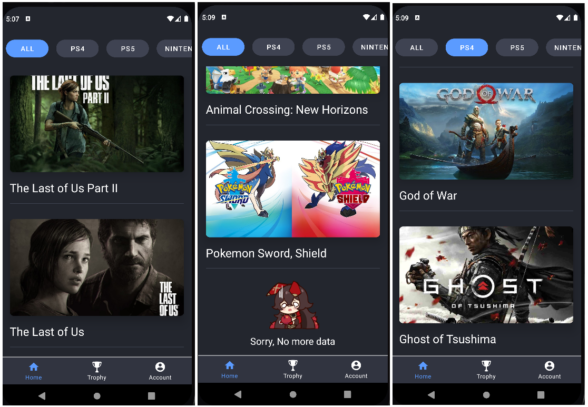
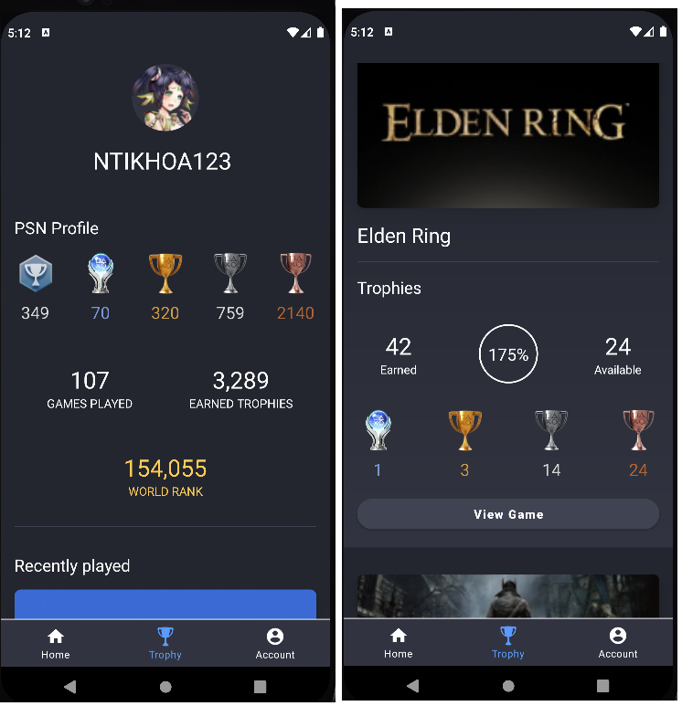
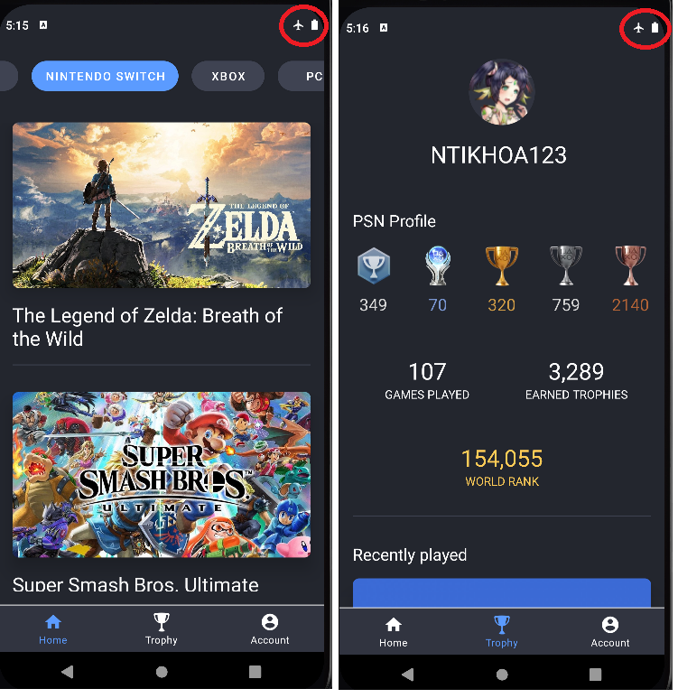

# GaHu
demo link: https://www.youtube.com/watch?v=7DLgglwiFcU
# Introduction
GaHu (Game Hunter), a project to view game info and Playstation trophy profile.<br/>
The main objective of the project is to apply caching technique using Room in Android development.<br/>
The project uses Kotlin for Android, NodeJS for Backend, and MongoDB for database.<br/>
Some of the main features of the app: can be use offline (without internet), view game info (and filter by Platforms), and view trophy profile (crawl data from https://psnprofiles.com)
# Technique uses
### Android
* Kotlin
* MVI with Clean Architecture
* Offline first app
* Caching using Room
* Flow
* Apply best practice
* Signle source of truth concept
* Pagination (no external library), multiple ViewHolder in Recyler View
* Dependency Injection (Hilt)
* Improvement from previous projects: background jobs are handled properly, no concurency errors
### Backend
* JavaScript, NodeJS, ExpressJS
* MongoDB, MongoAtlas
* MVC architecture
* AWS S3
* Deploy on Heroku
* Crawling: cheerio and axios
# Weeknesses
### Android: 
* MVI states consumption errors
* Room DB is not well optimized and designed
* Project is not completed (some side features are not implemented)
### Backend:
* Does not apply best pactices
* API are not well documented
# Portfolio
## Game Info

## Trophy Profile

## Offline


# Backend Organization
```
.
├── controllers
│   ├── auth.js
│   ├── game.js
│   ├── platform.js
│   ├── trophy.js
│   ├── user.js
├── middlewares
│   ├── auth.js
│   ├── ...
├── models
│   ├── game.js
│   ├── ...
├── routes        
│   ├── auth.js
│   ├── ...
├── seeds
├── utils
├── app.js
```
# How to run
Environment:
* SECRET_SIGNATURE &emsp; # Secret Signature for JWT
* AWS_BUCKET_NAME &emsp; # AWS key
* AWS_BUCKET_REGION
* AWS_ACCESS_KEY
* AWS_SECRET_KEY
* MONGO_DB_NAME &emsp; # Mongo Database
* MONGO_USERNAME
* MONGO_PASSWORD

Command: 
```
npm install
npm start
```

API documentation: api documentation.xlsx
